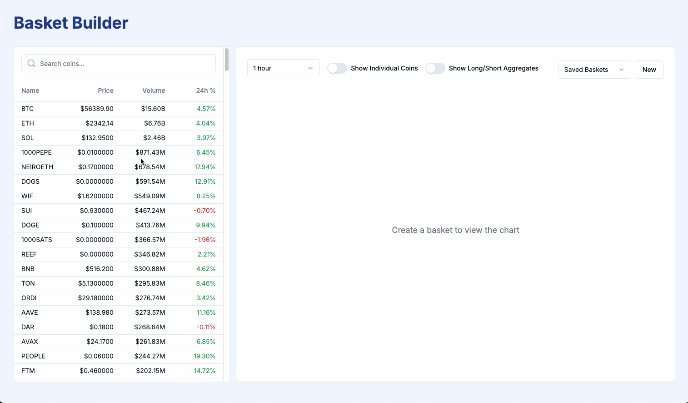

# Crypto Basket Builder

A Next.js application for creating and managing custom cryptocurrency baskets.

## Demo

## Quick Start

1. Clone the repository
2. Install dependencies: `npm install`
3. Run the development server: `npm run dev`
4. Open [http://localhost:3000](http://localhost:3000) in your browser

## Features

- Search and filter available cryptocurrencies
- Create custom baskets with selected coins
- Real-time price updates [TODO]
- Responsive design for desktop and [TODO: mobile]

## Tech Stack

- Next.js
- React
- Tailwind CSS

## Contributing

Contributions are welcome! Please feel free to submit a Pull Request.

## License

This project is open source and available under the [MIT License](LICENSE).
